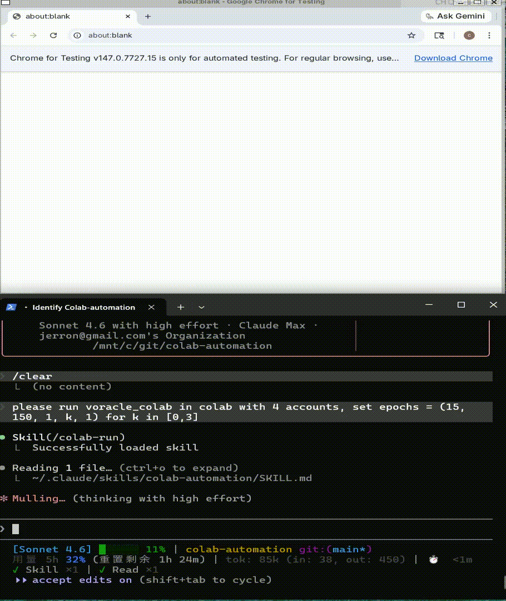

# 🧠 Colab Automation — Reproducible Notebook Execution

[](https://opensource.org/licenses/MIT-0)



Run Google Colab notebooks automatically and get results — without manual execution.
Treat .ipynb files as reproducible jobs, not UI workflows.

This project includes a [Claude Code](https://claude.ai/code) skill. You define:

- which notebook to run
- what parameters to change

The system handles everything else:

- syncing your code to Google Drive
- selecting the best available account
- opening and running the notebook
- applying parameter patches before execution
- managing the runtime (e.g. GPU selection)
- detecting completion or failure
- extracting and saving outputs
- cleaning up resources after run

👉 No need to stay connected or monitor execution.

## Typical uses

> "Run mybook.ipynb on Colab, comment out run_test"

> "Run viz_grid.ipynb on Colab. Keep session alive after finish"

> "Run training.ipynb on Colab with 4 accounts, set `epochs = (15, 150, 1, k, 1)` for each account k=[0,3]"

## 🎯 Purpose

Instead of:

Open → Edit → Run → Wait → Retry manually

You define what to run and what to change. The system handles execution end-to-end — including running the same notebook across multiple Google accounts in parallel for hyperparameter sweeps or batch experiments.

## ⚙️Setup

**Install:**

```bash
git clone https://github.com/jerronl/colab-automation.git
cd colab-automation
pip install -e .
playwright install chromium
```

**Install the Claude skill** (for natural language control via [Claude Code](https://claude.ai/code)):

```bash
mkdir -p ~/.claude/skills/colab-automation
cp SKILL.md ~/.claude/skills/colab-automation/
```

**Add Google accounts** (one-time per account):

> "Set up colab automation account"

Claude opens the browser with the dedicated profile and navigates to Colab. Log in to your Google accounts, then close the tab. The session is saved — subsequent runs reuse it automatically.

**Set up Google Drive sync** (optional — only needed if you sync local code before running):

```bash
# Install rclone
curl https://rclone.org/install.sh | sudo bash

# Authorize Google Drive (follow the prompts, name the remote "gdrive")
rclone config

# Verify
rclone ls gdrive:
```

## 🧩 RunConfig

**You usually don't need this — AI fills it for you. But for full control:**

### User parameters (set per-run)

| Field                   | Default  | Description                                                               |
| ----------------------- | -------- | ------------------------------------------------------------------------- |
| `notebook_id`           | required | Google Drive file ID (`""` when uploading a local file)                   |
| `local_notebook_path`   | `None`   | Upload this `.ipynb` via Colab UI before running                          |
| `cell_patches`          | `[]`     | `CellPatch` edits applied before running                                  |
| `require_gpu`           | varies   | Auto-switch CPU runtime to GPU before running (project-dependent default) |
| `disconnect_on_success` | `True`   | Disconnect runtime after successful run                                   |
| `output_extractor`      | `None`   | `fn(list[str]) -> str \| None` — extract text from output after execution |
| `output_path`           | `None`   | Write extracted output here; `None` = print only                          |

### Advanced parameters (usually auto-managed)

⚠️ **Note:** These parameters use default values when running via Claude Code skill. To customize them, use the Python API directly instead of the skill.

| Field                   | Default  | Description                                                               |
| ----------------------- | -------- | ------------------------------------------------------------------------- |
| `pivot_cell_pattern`    | `None`   | Regex; when matched cell starts running, switch to sparse polling         |
| `dense_interval`        | `1.0`    | Poll interval (s) before pivot                                            |
| `sparse_interval`       | `5.0`    | Poll interval (s) after pivot                                             |
| `max_connect_wait`      | `300`    | Seconds to wait for runtime to connect                                    |
| `max_run_wait`          | `2700`   | Seconds to wait for execution to finish                                   |
| `disconnect_on_error`   | `False`  | Also disconnect runtime on error                                          |
| `cdp_port`              | `9223`   | CDP port of the running Chromium instance                                 |
| `notebook_upload_fn`    | `None`   | Alternative upload fn (single-account only)                               |
| `code_sync_fn`          | `None`   | Code sync function (handled by skill's code_sync_src/dest)                |
| `code_sync_include`     | `*.py`   | File patterns to sync (e.g., `*.py` or `*.py,*.ipynb,*.md`)               |

### Account selection

**Do not specify `authuser` directly.** The framework auto-selects accounts via LRU and handles account rotation for parallel runs. When using the Claude Code skill, accounts are never exposed to users.

`RunResult` fields:

| Field | Values |
|-------|--------|
| `status` | `"completed"` / `"error"` / `"gpu_error"` / `"timeout"` |
| `authuser` | account that ran the notebook |
| `elapsed` | seconds |
| `output` | extracted output string, or `None` |

---

## 📄 License

MIT-0

## 🧋 Support

If Colab Automation saved you time, a coffee is always appreciated ☕

[](https://paypal.me/ZLiu308)

[paypal.me/ZLiu308](https://paypal.me/ZLiu308)

## ⚠️ Disclaimer

This project is intended for educational and research purposes.

Users are responsible for ensuring that their usage complies with all applicable service terms, including Google Colab's Terms of Service.

The maintainers are not responsible for any account restrictions, service limitations, or data loss resulting from misuse.
